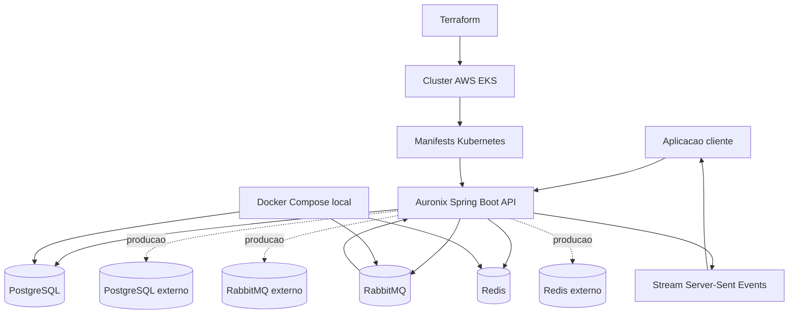

# Auronix Server

Auronix Server e um backend Spring Boot para usuarios, contas, saldos, transferencias assincronas, cobrancas e notificacoes de transacoes em tempo real. O projeto inclui codigo da aplicacao, dependencias locais em containers, manifests Kubernetes, infraestrutura Terraform para AWS EKS, testes automatizados e workflow GitHub Actions para validacao e publicacao de imagem Docker.

## Principais Tecnologias

- Java 26 e Spring Boot 4.0.6
- Maven Wrapper
- Spring Web, Spring Security, Spring Data JPA, Spring AMQP, Spring Data Redis e Spring Boot Actuator
- PostgreSQL, RabbitMQ e Redis
- Docker e Docker Compose
- Manifests Kubernetes para aplicacao e dependencias de runtime
- Terraform para provisionamento AWS EKS/VPC e deploy dos manifests Kubernetes
- GitHub Actions para CI/CD
- JUnit, suporte de testes Spring, Mockito, AssertJ, MockMvc e H2

## Resumo da Arquitetura

O backend expoe endpoints REST protegidos por cookie JWT HttpOnly. O PostgreSQL armazena usuarios, contas, transferencias e cobrancas. O RabbitMQ processa criacao assincrona de transferencias, notificacoes de transacoes concluidas e expiracao atrasada de cobrancas. O Redis armazena metadados de conexoes Server-Sent Events, enquanto os emissores SSE ativos ficam na instancia da aplicacao em execucao.

## Documentacao

A documentacao completa em portugues esta disponivel em [`docs/pt-br`](docs/pt-br/README.md):

- [Arquitetura](docs/pt-br/arquitetura/README.md)
- [Aplicacao](docs/pt-br/aplicacao/README.md)
- [Infraestrutura](docs/pt-br/infraestrutura/README.md)
- [Kubernetes](docs/pt-br/kubernetes/README.md)
- [Terraform](docs/pt-br/terraform/README.md)
- [Configuracao](docs/pt-br/configuracao/README.md)
- [Testes](docs/pt-br/testes/README.md)
- [CI/CD](docs/pt-br/ci-cd/README.md)
- [Operacao](docs/pt-br/operacao/README.md)
- [Seguranca](docs/pt-br/seguranca/README.md)
