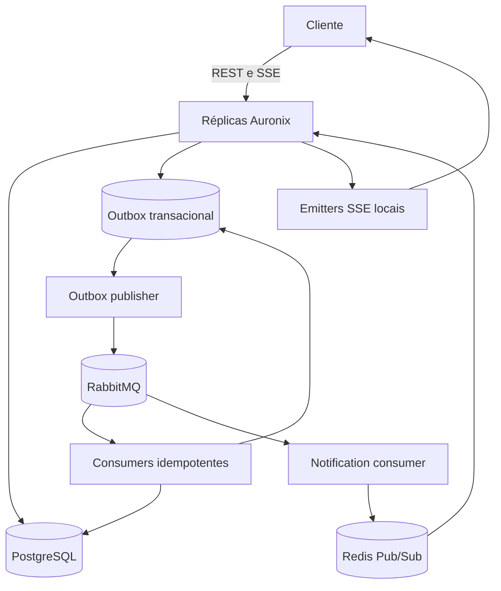

# Auronix Server

Auronix Server é um backend Java 26 / Spring Boot 4.0.6 para usuários, contas, saldos, transferências assíncronas, cobranças e notificações de transações em tempo real. O repositório contém a aplicação, topologia local Docker Compose, manifests Kubernetes com overlays Kustomize, stacks Terraform, scripts de validação, testes automatizados e workflow GitHub Actions.

## Principais Tecnologias

- PostgreSQL para usuários, contas, ledger, cobranças, outbox transacional e registros de idempotência.
- RabbitMQ para eventos de domínio assíncronos: criação de transferência, conclusão de transação e expiração atrasada de cobrança.
- Redis para metadata de conexões SSE e fan-out entre réplicas via Pub/Sub.
- Transactional Outbox para publicar eventos depois do commit PostgreSQL sem chamar RabbitMQ diretamente na transação de negócio.
- Consumers RabbitMQ idempotentes usando `eventId` e constraint única em `processed_events`.
- Lock pessimista determinístico de contas durante a liquidação de transferências.
- Check constraints de banco para invariantes financeiras.
- Docker Compose para desenvolvimento local, Kind/Kustomize para validação Kubernetes, Terraform para AWS EKS e aplicação de manifests, e Testcontainers para cobertura PostgreSQL real.

## Resumo da Arquitetura

Uma solicitação de transferência é validada de forma síncrona e persistida como evento `transfer.create` na outbox, na mesma transação PostgreSQL. Um publisher agendado reivindica linhas publicáveis em batches com `FOR UPDATE SKIP LOCKED`, envia ao RabbitMQ e marca como publicado ou agenda retry com backoff. Consumers processam mensagens RabbitMQ em semântica at-least-once e tornam os efeitos idempotentes inserindo o `eventId` em `processed_events` na mesma transação do efeito de negócio.

Na liquidação, o consumer resolve as contas de origem e destino, bloqueia ambas com `PESSIMISTIC_WRITE` em ordem determinística por UUID, revalida saldo, atualiza saldos, grava o ledger e persiste um evento `transaction.completed` na outbox. As notificações de conclusão passam por RabbitMQ e depois Redis Pub/Sub para que todas as réplicas recebam a mensagem; somente a réplica que possui o `SseEmitter` local envia o evento SSE.

## Runtime e Infraestrutura

Docker Compose representa apenas a topologia local de desenvolvimento. Ele inicia `server`, `db`, `message-br` e `cache` com health checks, volumes nomeados para PostgreSQL/RabbitMQ/Redis, Redis AOF e rede interna do Compose.

Kubernetes usa `k8s/base` mais overlays `local`, `staging` e `production`. Local serve para validação em Kind e inclui PostgreSQL, RabbitMQ e Redis dentro do cluster. Produção remove esses workloads de dependências e espera endpoints externos de PostgreSQL, RabbitMQ e Redis; o Terraform atual não provisiona RDS/Aurora, Amazon MQ ou ElastiCache.

Terraform é dividido entre `infra/terraform/cluster`, que provisiona VPC/EKS/node groups na AWS, e `infra/terraform/app`, que aplica os manifests planos de `k8s/*.yaml` pelo provider Kubernetes. O CI valida aplicação, teste PostgreSQL com Testcontainers, build Docker, manifests Kubernetes, Terraform e publica imagem Docker por SHA. No `main`, o workflow atual faz deploy do digest em um runner Docker self-hosted, não em EKS.

## Documentação

A documentação detalhada está em [`docs/pt-br`](docs/pt-br/README.md):

- [Arquitetura](docs/pt-br/arquitetura/README.md)
- [Aplicação](docs/pt-br/aplicacao/README.md)
- [Infraestrutura](docs/pt-br/infraestrutura/README.md)
- [Kubernetes](docs/pt-br/kubernetes/README.md)
- [Terraform](docs/pt-br/terraform/README.md)
- [Configuração](docs/pt-br/configuracao/README.md)
- [Testes](docs/pt-br/testes/README.md)
- [CI/CD](docs/pt-br/ci-cd/README.md)
- [Operação](docs/pt-br/operacao/README.md)
- [Segurança](docs/pt-br/seguranca/README.md)
