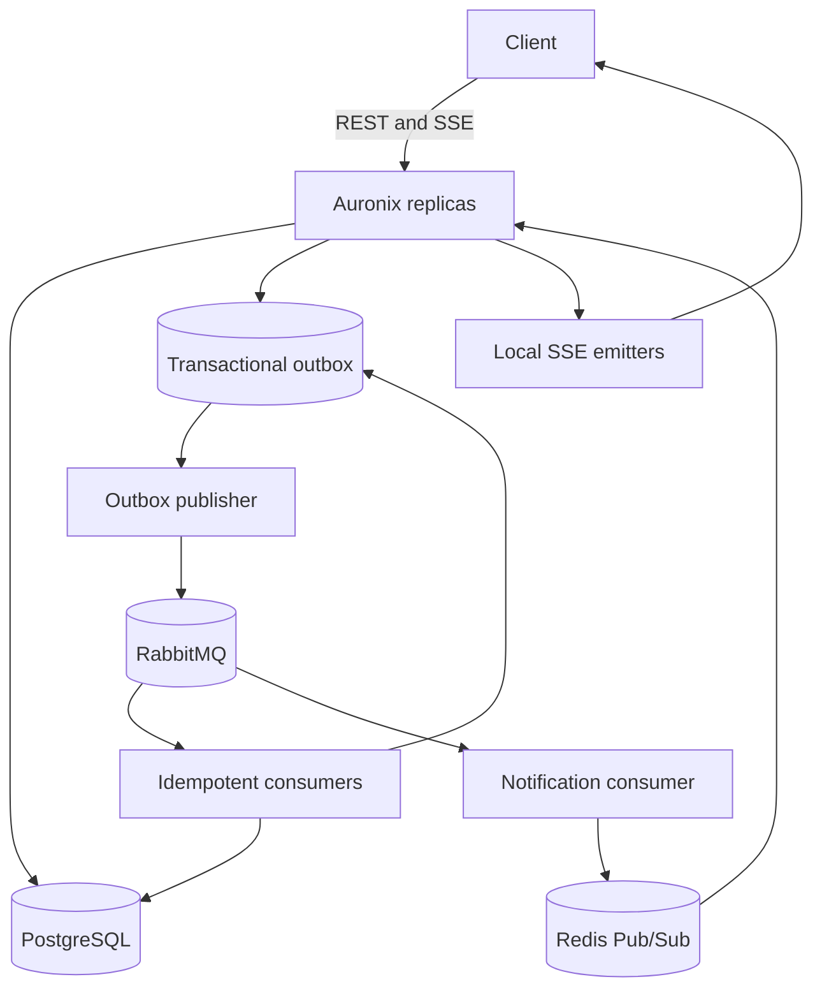

# Auronix Server

Auronix Server is a Java 26 / Spring Boot 4.0.6 backend for users, accounts, wallet-like balances, asynchronous transfers, payment requests, and realtime transaction notifications. The repository contains the application, Docker Compose local topology, Kubernetes manifests with Kustomize overlays, Terraform infrastructure stacks, validation scripts, automated tests, and GitHub Actions workflow.

## Main Technologies

- PostgreSQL for users, accounts, ledger transactions, payment requests, transactional outbox, and processed-event idempotency records.
- RabbitMQ for asynchronous domain events: transfer creation, transaction completion, and delayed payment-request expiration.
- Redis for SSE connection metadata and Redis Pub/Sub fan-out across application replicas.
- Transactional Outbox for publishing events after the PostgreSQL commit without calling RabbitMQ directly from the business transaction.
- Idempotent RabbitMQ consumers using `eventId` and the `processed_events` uniqueness constraint.
- Deterministic pessimistic account locking for transfer settlement.
- Database check constraints for financial invariants.
- Docker Compose for local development, Kind/Kustomize for Kubernetes validation, Terraform for AWS EKS and Kubernetes manifest application, and Testcontainers for PostgreSQL integration coverage.

## Architecture Summary

```mermaid
flowchart TD
    Client[Client] -->|REST and SSE| API[Auronix replicas]
    API --> PG[(PostgreSQL)]
    API --> OB[(Transactional outbox)]
    OB --> Publisher[Outbox publisher]
    Publisher --> RMQ[(RabbitMQ)]
    RMQ --> Consumers[Idempotent consumers]
    Consumers --> PG
    Consumers --> OB
    RMQ --> Notify[Notification consumer]
    Notify --> Redis[(Redis Pub/Sub)]
    Redis --> API
    API --> LocalSSE[Local SSE emitters]
    LocalSSE --> Client
```

A transfer request is validated synchronously and persisted as a `transfer.create` outbox event in the same PostgreSQL transaction. A scheduled publisher claims publishable outbox rows in batches with `FOR UPDATE SKIP LOCKED`, sends them to RabbitMQ, and marks them as published or retries them with backoff. Consumers process RabbitMQ messages at least once and make effects idempotent by inserting `eventId` into `processed_events` inside the same transaction as the business effect.

During settlement, the transfer consumer resolves the payer and payee accounts, locks both accounts with `PESSIMISTIC_WRITE` in deterministic UUID order, rechecks the payer balance, updates balances, writes the ledger entry, and stores a `transaction.completed` event in the outbox. Completion notifications are published through RabbitMQ and then Redis Pub/Sub so every replica receives the notification; only the replica that owns the local `SseEmitter` sends the SSE event.

## Runtime and Infrastructure

Docker Compose is only the local development topology. It starts `server`, `db`, `message-br`, and `cache` with health checks, named volumes for PostgreSQL/RabbitMQ/Redis, Redis AOF, and an internal Compose network.

Kubernetes uses `k8s/base` plus `local`, `staging`, and `production` overlays. Local is for Kind validation and includes in-cluster PostgreSQL, RabbitMQ, and Redis. Production removes those dependency workloads and expects external PostgreSQL, RabbitMQ, and Redis endpoints; the current Terraform does not provision RDS/Aurora, Amazon MQ, or ElastiCache.

Terraform is split into `infra/terraform/cluster` for AWS VPC/EKS/node groups and `infra/terraform/app` for applying the flat production-oriented manifests in `k8s/*.yaml` through the Kubernetes provider. CI validates the application, Testcontainers PostgreSQL test, Docker build, Kubernetes manifests, Terraform, and then publishes a SHA-tagged Docker image. On `main`, the current workflow deploys the image digest to a self-hosted Docker runner, not to EKS.

## Documentation

Detailed documentation is available in [`docs/en`](docs/en/README.md):

- [Architecture](docs/en/architecture/README.md)
- [Application](docs/en/application/README.md)
- [Infrastructure](docs/en/infrastructure/README.md)
- [Kubernetes](docs/en/kubernetes/README.md)
- [Terraform](docs/en/terraform/README.md)
- [Configuration](docs/en/configuration/README.md)
- [Testing](docs/en/testing/README.md)
- [CI/CD](docs/en/ci-cd/README.md)
- [Operations](docs/en/operations/README.md)
- [Security](docs/en/security/README.md)
