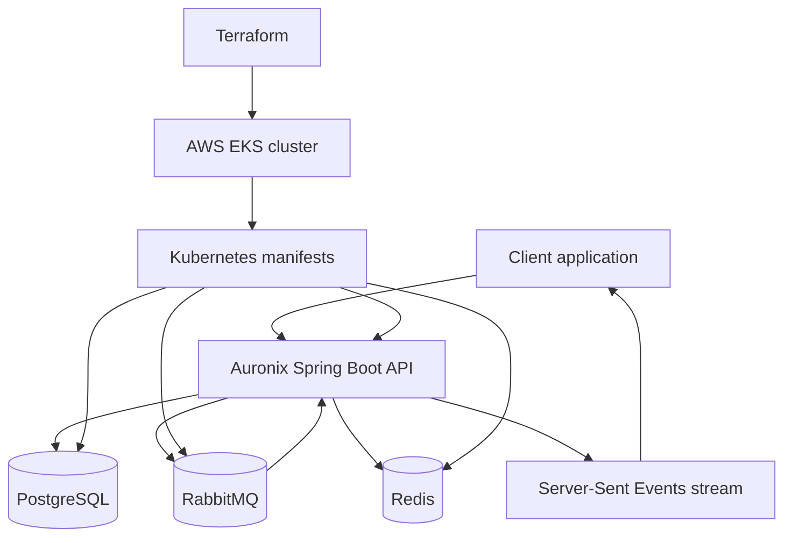

# Auronix Server

Auronix Server is a Spring Boot backend for user accounts, wallet-like balances, asynchronous transfers, payment requests, and real-time transaction notifications. The project includes the application code, local container dependencies, Kubernetes manifests, Terraform infrastructure for AWS EKS, automated tests, and a GitHub Actions workflow for validation and Docker image publishing.

## Main Technologies

- Java 26 and Spring Boot 4.0.6
- Maven Wrapper
- Spring Web, Spring Security, Spring Data JPA, Spring AMQP, Spring Data Redis, and Spring Boot Actuator
- PostgreSQL, RabbitMQ, and Redis
- Docker and Docker Compose
- Kubernetes manifests for application and runtime dependencies
- Terraform for AWS EKS/VPC provisioning and Kubernetes manifest deployment
- GitHub Actions for CI/CD
- JUnit, Spring test support, Mockito, AssertJ, MockMvc, and H2

## Architecture Summary

The backend exposes REST endpoints secured with an HttpOnly JWT cookie. PostgreSQL stores users, accounts, transfers, and payment requests. RabbitMQ handles asynchronous transfer creation, transaction completion notifications, and delayed payment request expiration. Redis stores metadata for Server-Sent Events connections, while active SSE emitters are kept in the running application instance.

```mermaid
flowchart TD
    Client[Client application] --> API[Auronix Spring Boot API]
    API --> DB[(PostgreSQL)]
    API --> MQ[(RabbitMQ)]
    API --> Cache[(Redis)]
    MQ --> API
    API --> SSE[Server-Sent Events stream]
    SSE --> Client
    Terraform[Terraform] --> EKS[AWS EKS cluster]
    EKS --> K8s[Kubernetes manifests]
    K8s --> API
    K8s --> DB
    K8s --> MQ
    K8s --> Cache
```

## Documentation

Complete English documentation is available in [`docs/en`](docs/en/README.md):

- [Architecture](docs/en/architecture/README.md)
- [Application](docs/en/application/README.md)
- [Infrastructure](docs/en/infrastructure/README.md)
- [Kubernetes](docs/en/kubernetes/README.md)
- [Terraform](docs/en/terraform/README.md)
- [Configuration](docs/en/configuration/README.md)
- [Testing](docs/en/testing/README.md)
- [CI/CD](docs/en/ci-cd/README.md)
- [Operations](docs/en/operations/README.md)
- [Security](docs/en/security/README.md)
