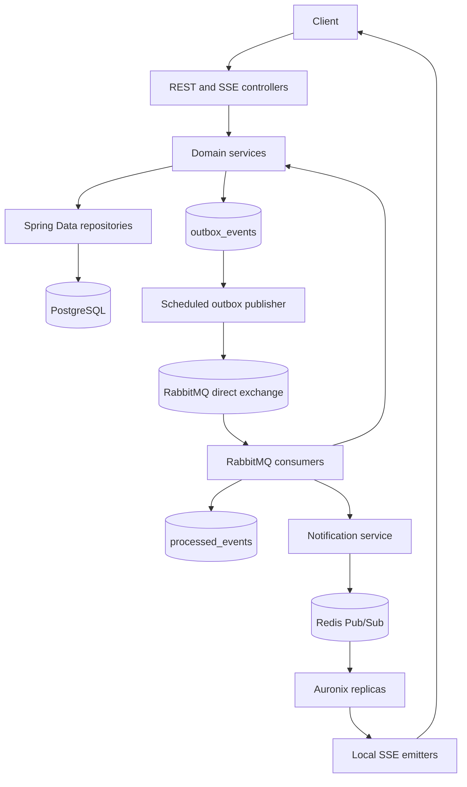
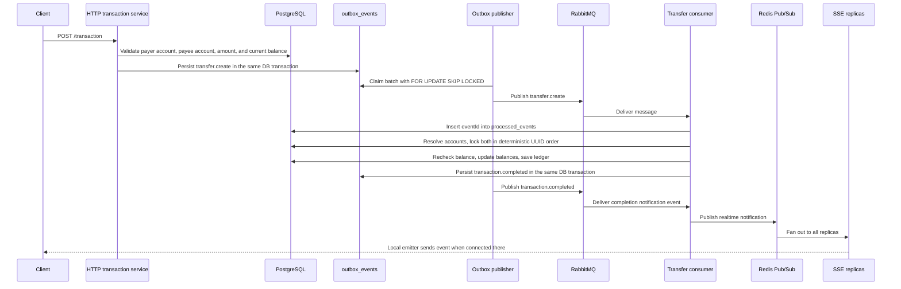
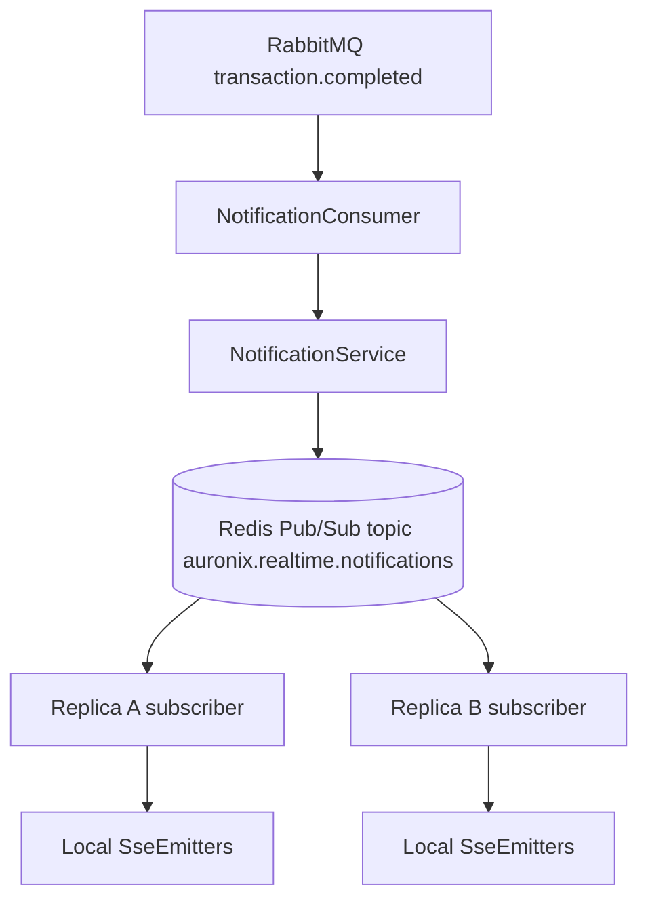

# Architecture

## Overview

Auronix is a layered Spring Boot backend. Controllers receive HTTP/SSE requests, services enforce business rules, Spring Data repositories persist state in PostgreSQL, the transactional outbox records domain events in the same commit as business changes, RabbitMQ transports events, idempotent consumers apply side effects, and Redis Pub/Sub distributes realtime notifications across replicas.

## Transfer Flow

The deterministic lock order matters because concurrent transfers may need the same pair of accounts from opposite directions. Sorting account IDs before acquiring `PESSIMISTIC_WRITE` locks makes competing transactions request locks in the same order, reducing predictable deadlock cycles. The balance is checked again inside the locked transaction because the earlier HTTP validation can become stale before the consumer settles the transfer.

## Transactional Outbox

`OutboxService.enqueue` requires an existing transaction through `Propagation.MANDATORY`. That means a business change and its event row commit or roll back together in PostgreSQL. The application does not use a distributed transaction between PostgreSQL and RabbitMQ.

Outbox rows use these statuses:

- `PENDING`: ready to publish when `next_attempt_at` is due.
- `PROCESSING`: claimed by a publisher. The claim sets `next_attempt_at` to five minutes in the future so abandoned work can be retried later.
- `PUBLISHED`: RabbitMQ send completed and `published_at` was set.

`OutboxPublisher` runs on a fixed delay of `app.outbox.publish-delay-ms` with default `1000` ms and claims up to `app.outbox.batch-size`, default `50`. The repository query selects `PENDING` and timed-out `PROCESSING` rows ordered by `created_at` with `FOR UPDATE SKIP LOCKED`, so multiple replicas can publish concurrently without claiming the same rows in the same batch. On send failure, the row returns to `PENDING`, `attempts` increments, and the next attempt is delayed by exponential backoff capped at 300 seconds.

The outbox gives transactional consistency between business state and the intent to publish. It does not guarantee single RabbitMQ delivery. If RabbitMQ accepts a message and the process dies before `PUBLISHED` is stored, the event can be published again.

## Idempotent Consumers

RabbitMQ delivery is treated as at-least-once. `IdempotentMessageService.process` inserts `eventId` into `processed_events` using `on conflict (event_id) do nothing`. A unique constraint named `uk_processed_events_event_id` enforces one successful insert per event.

The insert and the business effect run in one Spring transaction. If the action fails, the transaction rolls back and the `eventId` record rolls back with it, allowing a later redelivery to retry the work. If the same message is delivered again after success, the insert affects zero rows, the action is skipped, and `rabbitmq_duplicate_messages_total` increments.

This is not exactly-once delivery. It is at-least-once delivery with idempotent effects for consumers that use the shared wrapper.

## Financial Invariants

Application validation rejects invalid transfer amounts, self-transfers, missing accounts, and insufficient balance before enqueueing the transfer. The settlement transaction repeats critical validation while holding locks.

PostgreSQL-level invariants currently declared through JPA check constraints include:

- `accounts.balance >= 0`.
- `ledger_transactions.amount > 0`.
- `ledger_transactions` payer/payee balance snapshots are non-negative.
- `payment_requests.value > 0`.
- `payment_requests.expires_at > payment_requests.created_at`.

Application validation improves user feedback and avoids unnecessary work. Database constraints are the final guard for persisted state.

## Realtime Across Replicas

`SseEmitter` objects are never shared through Redis. Each replica keeps active emitters in local memory. `SseRegistryService` writes connection metadata to Redis with a 30-minute TTL, and `NotificationService` publishes realtime payloads to Redis Pub/Sub. Every subscribed replica receives the message; only replicas with matching local emitters send the SSE event.

Redis Pub/Sub is not durable replay storage. If a user is disconnected during publication, the durable state remains in PostgreSQL and the client must recover through HTTP reads.

## Reliability Metrics

Micrometer counters currently used in code:

| Metric | Incremented by | Meaning |
| --- | --- | --- |
| `outbox_published_total` | `OutboxPublisher` | Outbox messages successfully sent to RabbitMQ and marked published |
| `outbox_publish_failures_total` | `OutboxPublisher` | RabbitMQ send attempts that failed and were scheduled for retry |
| `rabbitmq_messages_processed_total` | `IdempotentMessageService` | Messages whose `eventId` was first seen and whose action completed |
| `rabbitmq_duplicate_messages_total` | `IdempotentMessageService` | Redelivered or duplicate messages skipped by idempotency |

The repository configures counters in code, but does not currently include Prometheus, Grafana, or dashboards.

## Failure Modes

- Failure before PostgreSQL commit: the business change and outbox row roll back together.
- Failure after commit but before RabbitMQ publish: the outbox row remains recoverable for a later publisher cycle.
- Failure after RabbitMQ publish but before marking `PUBLISHED`: the event may be republished, and idempotent consumers must handle duplicates.
- RabbitMQ redelivery: consumers using `IdempotentMessageService` skip already processed `eventId` values.
- Two concurrent transfers: deterministic pessimistic locking plus in-transaction balance revalidation protects financial invariants.
- Multiple outbox publishers: `FOR UPDATE SKIP LOCKED` lets replicas claim different rows concurrently.
- SSE connection on another replica: Redis Pub/Sub broadcasts to all replicas so the one with the local emitter can send.
- Pod restart: graceful shutdown, Kubernetes probes, outbox persistence, and idempotency records reduce lost work, but in-flight non-durable Redis Pub/Sub notifications can still be missed.
