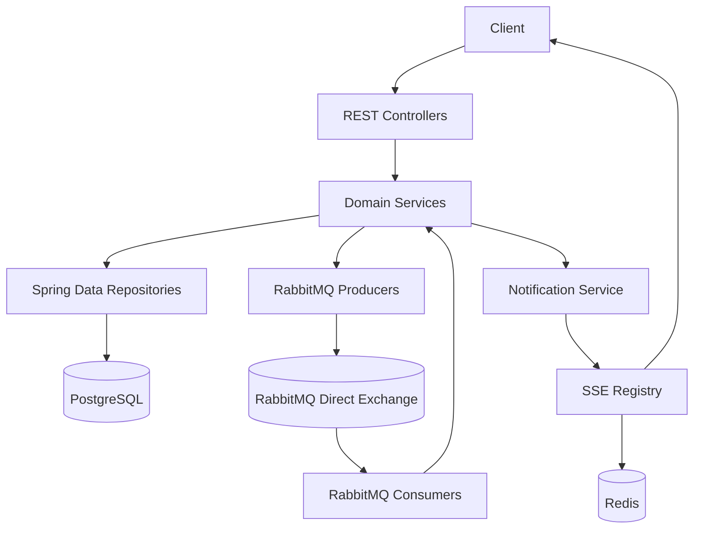
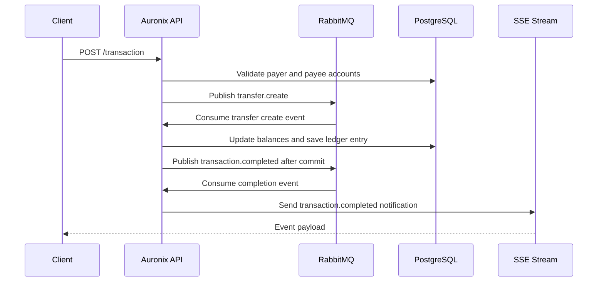
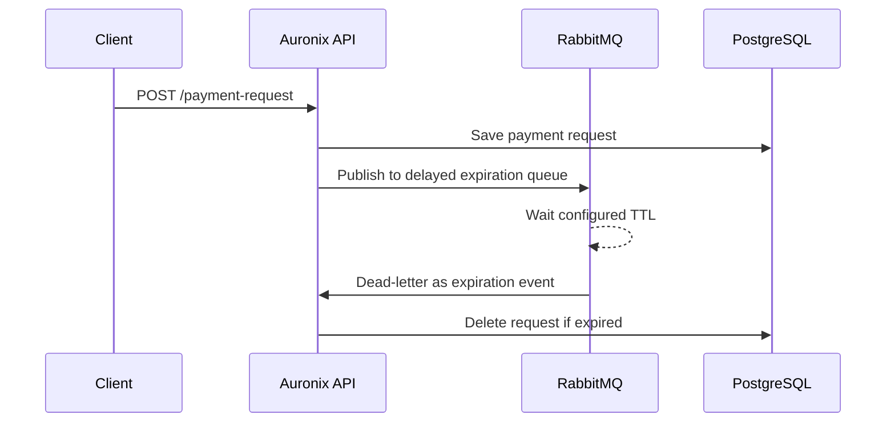

# Architecture

## Overview

Auronix is organized as a layered Spring Boot backend. HTTP controllers receive client requests, service classes enforce business rules, Spring Data repositories persist entities in PostgreSQL, RabbitMQ transports asynchronous events, and Redis stores metadata for active SSE notification connections.

## Main Components

- User module: registration, login, token refresh through `/user`, profile update, and deletion.
- Account module: account lookup by authenticated user and account lookup by user email.
- Transaction module: validates transfer requests, publishes asynchronous transfer creation events, records ledger transactions, and publishes completion events.
- Payment request module: creates payment requests, retrieves active requests, and removes expired requests through a delayed RabbitMQ flow.
- Notification module: exposes an SSE stream and sends transaction completion notifications to involved users.
- Shared security: creates and validates JWTs, hashes passwords with Argon2, and authenticates requests from the `access_token` cookie.

## Main Flows

## Infrastructure Relationship

Terraform is split into two stacks. The cluster stack provisions the AWS VPC and EKS cluster. The app stack reads the Kubernetes YAML manifests from `k8s` and applies them through the Terraform Kubernetes provider.
