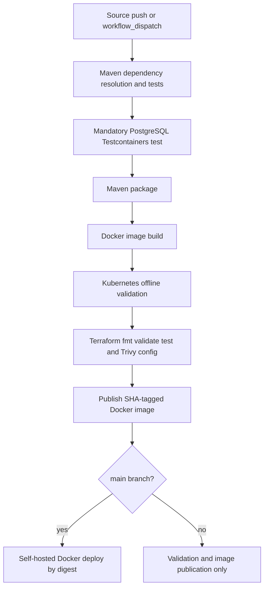

# CI/CD

## Workflow

The repository contains `.github/workflows/main.yml`, named `Continuous Integration and Deployment`.

## Triggers, Permissions, and Concurrency

The workflow runs on every push to every branch and supports manual `workflow_dispatch`. It grants `contents: read` and `packages: write`. Concurrency is grouped by workflow and Git ref, with in-progress runs cancelled for the same ref.

## Validate Job

`validate` runs on `ubuntu-latest` and executes, in order:

1. Checkout.
2. Temurin Java 26 setup with Maven cache.
3. `kubectl` setup.
4. Terraform setup.
5. Maven wrapper executable bit.
6. `./mvnw -B dependency:go-offline`.
7. `./mvnw -B test`.
8. Mandatory `FinancePostgresIntegrationTest` run with Docker/Testcontainers, followed by XML assertions that `skipped`, `failures`, and `errors` are all zero.
9. `./mvnw -B package -DskipTests`.
10. `docker build -t auronix-server:${{ github.sha }} .`.
11. `./scripts/validate-k8s-offline.ps1`.
12. `./scripts/validate-terraform.ps1`.

This job validates the application, PostgreSQL-specific integration behavior, Docker build, Kustomize-rendered Kubernetes manifests, Terraform syntax/tests, and static infrastructure scan. It does not apply Terraform and does not deploy to EKS.

## Publish Job

`publish` depends on `validate`. It checks out the repository, sets up Docker Buildx, logs in to Docker Hub with `DOCKER_USERNAME` and `DOCKER_PASSWORD`, generates Docker metadata for `docker.io/jpplay/auronix-server`, and pushes a long SHA tag. The job exposes the pushed image digest as `image_digest`.

The current metadata configuration does not publish `latest`.

## Deploy Job

`deploy` runs only on `refs/heads/main`, after `publish`, on a self-hosted runner. It writes the `DOTENV` secret to `.env`, logs in to Docker Hub, pulls the published image by digest, replaces any existing `auronix-server` container, and starts the container on Docker network `cloudflare_tunnel` with resource limits and `--restart=always`.

This is a Docker deployment on a self-hosted runner. The workflow does not perform a production EKS deployment.

## Pipeline Shape

## Separation of Concerns

- CI validation: `validate`.
- Container publication: `publish`.
- Infrastructure validation: Kubernetes offline validation and Terraform validation/tests inside `validate`.
- Production deployment in this workflow: self-hosted Docker container replacement on `main`, not EKS.
