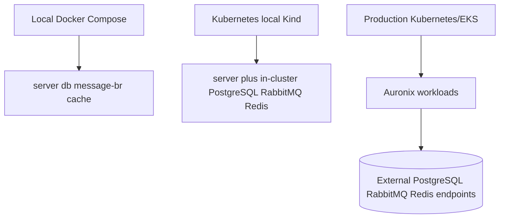

# Infrastructure

## Local Docker Compose

`compose.yaml` is the local development topology. It is not the production architecture.

| Service | Image/source | Ports | Persistence | Health check |
| --- | --- | --- | --- | --- |
| `server` | local `Dockerfile` build | `8080:8080` | none | TCP check on port `8080` |
| `db` | `postgres:17-alpine` | `5432:5432` | `auronix-data` | `pg_isready -U postgres -d auronix` |
| `message-br` | `rabbitmq:4-management` | `5672:5672`, `15672:15672` | `auronix-rabbitmq` | `rabbitmq-diagnostics ping` and AMQP port check |
| `cache` | `redis:8-alpine` | `6379:6379` | `auronix-redis` | `redis-cli ping` |

The server depends on healthy `db`, `message-br`, and `cache`. The dependency services use `restart: always`; the server uses `restart: unless-stopped`. Redis starts with append-only file persistence enabled through `redis-server --appendonly yes`. All services share the internal `auronix-local` Compose network.

The backend uses these Compose URLs inside the network:

- PostgreSQL: `jdbc:postgresql://db:5432/auronix`
- RabbitMQ: `amqp://message-br:5672/`
- Redis: `redis://cache:6379`

## Container Image

The `Dockerfile` uses multi-stage builds:

1. `eclipse-temurin:26-jdk-jammy` dependency stage with Maven dependency cache.
2. Package stage running `./mvnw package -DskipTests`.
3. Spring Boot layertools extraction.
4. `eclipse-temurin:26-jre-jammy` runtime stage.

The final image runs as non-root `appuser`, exposes `8080`, and starts `org.springframework.boot.loader.launch.JarLauncher`.

## Kubernetes Topologies

Kubernetes manifests are organized in two forms:

- Kustomize base and overlays under `k8s/base` and `k8s/overlays`.
- Flat manifests under `k8s/*.yaml`, consumed by `infra/terraform/app`.

Local Kustomize validation includes PostgreSQL, RabbitMQ, and Redis in the cluster. Production Kustomize removes those dependency workloads and expects external endpoints.

## AWS and Terraform

`infra/terraform/cluster` provisions AWS VPC and EKS resources. `infra/terraform/app` applies Kubernetes resources from the flat `k8s/*.yaml` set. The current Terraform does not declare RDS/Aurora, Amazon MQ, ElastiCache, or other managed PostgreSQL/RabbitMQ/Redis resources.

## Current Limits

- Docker Compose is local-only.
- Production Kubernetes manifests require externally supplied database, broker, and Redis endpoints.
- Terraform does not currently provision managed PostgreSQL, RabbitMQ, or Redis.
- Redis Pub/Sub is realtime fan-out, not durable notification storage.
- Kind validates workload behavior in a disposable local cluster, but it does not replace EKS validation.
