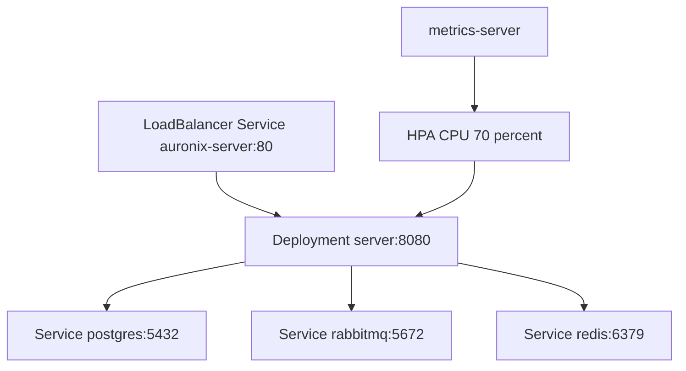

# Kubernetes

## Resource Set

The `k8s` directory contains manifests for the `auronix` namespace and runtime services:

- `namespace.yaml`: creates namespace `auronix`.
- `configmap.yaml`: application runtime settings such as `PORT`, database URL, RabbitMQ URL, Redis URL, and JPA options.
- `secrets.yaml`: expected secret keys for database credentials, RabbitMQ credentials, and JWT signing.
- `server.yaml`: API deployment and `LoadBalancer` service.
- `postgres.yaml`: PostgreSQL deployment and internal service.
- `rabbitmq.yaml`: RabbitMQ deployment and internal service.
- `redis.yaml`: Redis deployment and internal service.
- `metrics-server.yaml`: metrics-server deployment and RBAC resources in `kube-system`.
- `hpa.yaml`: HorizontalPodAutoscaler for the API deployment.

## Runtime Topology

## API Deployment

The `server` deployment uses image `jpplay/auronix-server:latest`, `imagePullPolicy: Always`, and container port `8080`. It receives configuration from `auronix-config` and sensitive values from `auronix-secrets`. Readiness and liveness probes target `/actuator/health`.

Resource requests are `250m` CPU and `512Mi` memory. Limits are `750m` CPU and `1Gi` memory. The service `auronix-server` is type `LoadBalancer`, mapping port `80` to the container `http` port.

## Dependencies

PostgreSQL, RabbitMQ, and Redis run as single-replica deployments with internal ClusterIP services. PostgreSQL and RabbitMQ use readiness and liveness probes based on their native diagnostic commands. Redis uses `redis-cli ping`.

Important observation: the Postgres manifest stores data in `emptyDir`. For production environments, use a persistent volume and backup/migration strategy.

## Autoscaling and Metrics

The HPA targets the `server` deployment, with one to three replicas and CPU utilization target of 70 percent. The included metrics-server manifest provides the metrics API required by the HPA.
