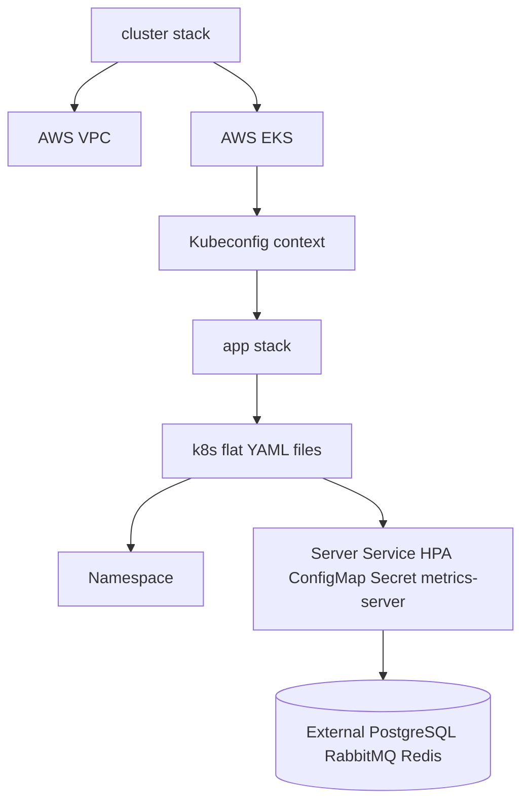

# Terraform

## Organization

Terraform is split into two independent stacks:

- `infra/terraform/cluster`: AWS networking and EKS.
- `infra/terraform/app`: Kubernetes resources applied to an existing Kubernetes context.

## Cluster Stack

The cluster stack requires Terraform `>= 1.6.0` and AWS provider `~> 5.0`. It uses `terraform-aws-modules/vpc/aws` `~> 5.0` and `terraform-aws-modules/eks/aws` `~> 20.0`.

It declares:

- AWS provider with default tags.
- Availability zone data source.
- VPC with public and private subnets derived from `vpc_cidr` and `az_count`.
- DNS support and hostnames enabled.
- NAT Gateway enabled, with `single_nat_gateway` configurable.
- Kubernetes load balancer tags on subnets.
- EKS cluster with configurable version, service CIDR, endpoint access, and core add-ons `coredns`, `kube-proxy`, and `vpc-cni`.
- Managed node group with configurable instance types and min/desired/max sizes.
- Node security group rules, including restricted HTTPS egress CIDRs.

Outputs expose cluster name, region, endpoint, VPC id, private subnet ids, node security group id, and the `aws eks update-kubeconfig` command.

The cluster stack does not declare RDS/Aurora, Amazon MQ, ElastiCache, or any managed PostgreSQL/RabbitMQ/Redis equivalent.

## App Stack

The app stack requires Terraform `>= 1.6.0` and Kubernetes provider `~> 2.33`. It does not render the Kustomize overlays. It reads this flat manifest list from `k8s/*.yaml`:

- `namespace.yaml`
- `secrets.yaml`
- `configmap.yaml`
- `metrics-server.yaml`
- `server.yaml`
- `hpa.yaml`

It splits multi-document YAML, decodes each manifest, converts `Secret.stringData` into base64 `data`, applies the namespace first, and then applies the remaining resources with `kubernetes_manifest`.

Because this flat set excludes `postgres.yaml`, `rabbitmq.yaml`, and `redis.yaml`, the app stack expects external PostgreSQL, RabbitMQ, and Redis endpoints from `k8s/configmap.yaml`.



## Terraform Tests

The tests use `mock_provider` and overrides so contracts can be checked without creating AWS or Kubernetes resources.

Cluster tests assert, among other things:

- Environment, CIDR, and node count validations reject invalid input.
- Production VPC naming, CIDR, AZ/subnet counts, DNS settings, NAT strategy, and load balancer subnet tags are preserved.
- Production EKS name/version, private endpoint default, creator permissions, core add-ons, and HTTPS egress CIDRs are preserved.
- Managed node group desired size stays between min and max and uses configured instance types.
- Essential outputs expose cluster, endpoint, VPC, private subnets, and node security group.

App tests assert:

- The production app stack does not create local PostgreSQL, RabbitMQ, or Redis workloads.
- External PostgreSQL, RabbitMQ, and Redis placeholders are required in the ConfigMap.
- Server replicas remain 2.
- HPA bounds remain 2 to 3.
- `terminationGracePeriodSeconds` remains 45.
- Startup, liveness, and readiness probe paths remain `/actuator/health/liveness`, `/actuator/health/liveness`, and `/actuator/health/readiness`.

## Validation Commands

`scripts/validate-terraform.ps1` runs both stacks through:

```text
terraform fmt -check -recursive
terraform init -backend=false
terraform validate
terraform test
Trivy config scan
```

If a local `trivy` binary exists it is used; otherwise the script runs `aquasec/trivy:latest` in Docker. This validation does not create AWS infrastructure.

`terraform validate` checks configuration validity. `terraform test` runs repository-defined assertions, here using mocked providers. `terraform plan` computes a proposed change against a real or configured provider/backend and is only part of the connected AWS script.

## Connected AWS Validation

`scripts/validate-aws.ps1` requires valid AWS credentials. It starts with `aws sts get-caller-identity`; if that fails, it prints that validation was skipped because credentials are unavailable or expired and exits with code 2.

With credentials, it prints account, ARN, region, and cluster, runs Terraform `init`, shows workspace, creates a plan file, describes the EKS cluster, updates kubeconfig, checks kubectl access, runs server-side dry-run for the production overlay, and runs `kubectl diff`.

## Apply

`terraform apply` and `terraform destroy` are not executed by validation scripts. Use them only manually after reviewing account, region, workspace, backend, plan, and expected impact.
