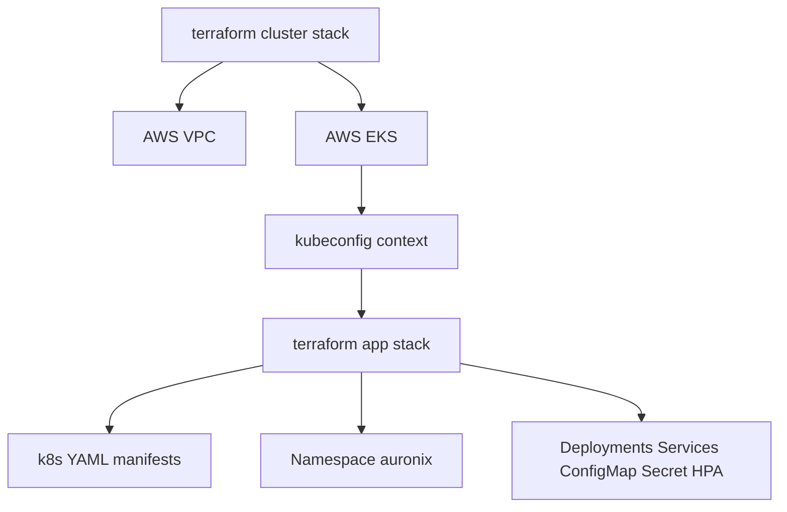

# Terraform

## Organization

Terraform is split into two stacks:

- `infra/terraform/cluster`: provisions AWS networking and EKS.
- `infra/terraform/app`: applies Kubernetes manifests to an existing Kubernetes context.

## Cluster Stack

The cluster stack requires Terraform `>= 1.6.0` and AWS provider `~> 5.0`. It uses:

- `terraform-aws-modules/vpc/aws` `~> 5.0`
- `terraform-aws-modules/eks/aws` `~> 20.0`

Main variables include AWS region, environment, cluster name, Kubernetes version, service CIDR, VPC CIDR, availability zone count, NAT Gateway mode, node instance types, and node group sizes.

Outputs include cluster name, region, endpoint, and a command to update kubeconfig for the created EKS cluster.

## App Stack

The app stack requires Terraform `>= 1.6.0` and Kubernetes provider `~> 2.33`. It reads the YAML files from `k8s`, splits multi-document manifests, decodes YAML, converts `Secret.stringData` to base64-encoded `data`, applies the namespace first, and then applies all other resources.



## Common Commands

```bash
cd infra/terraform/cluster
terraform init
terraform plan
terraform apply
```

```bash
cd infra/terraform/app
terraform init
terraform plan
terraform apply
```

Operational consideration: review `terraform plan` before `terraform apply`. Destructive commands such as `terraform destroy` should be used only when intentionally removing the environment.
