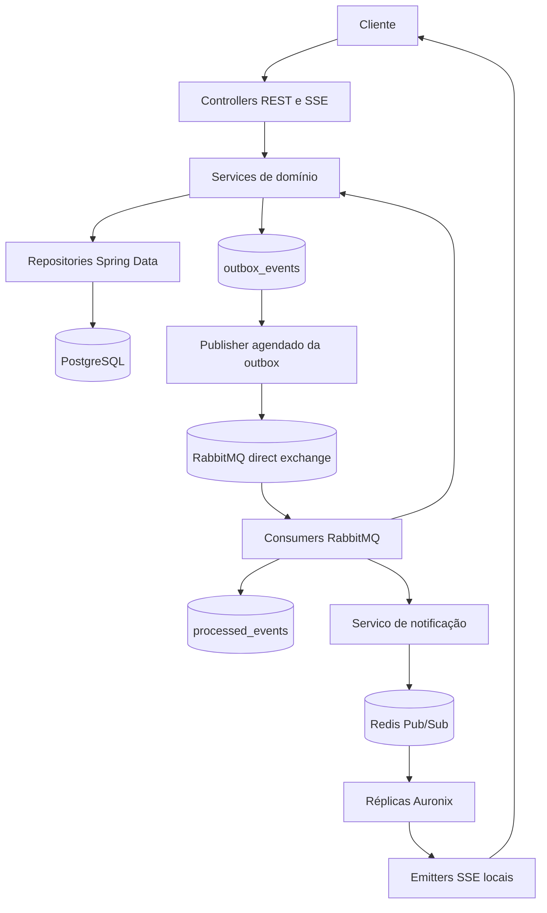
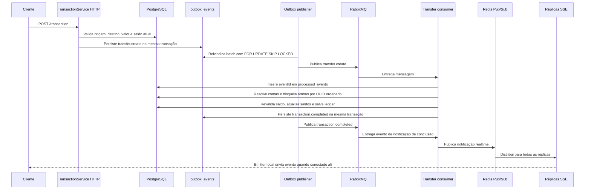
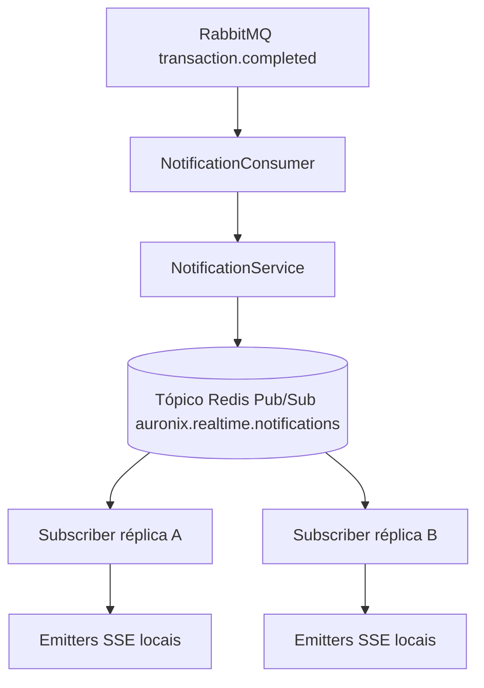

# Arquitetura

## Visão Geral

Auronix é um backend Spring Boot em camadas. Controllers recebem requisições HTTP/SSE, services aplicam regras de negócio, repositories Spring Data persistem estado no PostgreSQL, a outbox transacional registra eventos de domínio no mesmo commit das mudanças de negócio, RabbitMQ transporta eventos, consumers idempotentes aplicam efeitos e Redis Pub/Sub distribui notificações realtime entre réplicas.

## Fluxo de Transferencia

A ordenação determinística dos locks importa porque transferências concorrentes podem precisar do mesmo par de contas em direções opostas. Ordenar os IDs antes de adquirir locks `PESSIMISTIC_WRITE` faz transações concorrentes pedirem locks na mesma ordem, reduzindo ciclos previsíveis de deadlock. O saldo é checado novamente dentro da transação bloqueada porque a validação HTTP anterior pode ficar obsoleta antes da liquidação pelo consumer.

## Outbox Transacional

`OutboxService.enqueue` exige uma transação existente por `Propagation.MANDATORY`. Assim, a mudança de negócio e a linha de evento são confirmadas ou revertidas juntas no PostgreSQL. A aplicação não usa transação distribuída entre PostgreSQL e RabbitMQ.

Estados da outbox:

- `PENDING`: pronto para publicação quando `next_attempt_at` venceu.
- `PROCESSING`: reivindicado por um publisher. O claim define `next_attempt_at` cinco minutos no futuro para permitir retry de trabalho abandonado.
- `PUBLISHED`: envio RabbitMQ concluiu e `published_at` foi definido.

`OutboxPublisher` roda por fixed delay `app.outbox.publish-delay-ms`, default `1000` ms, e reivindica até `app.outbox.batch-size`, default `50`. A query seleciona linhas `PENDING` e `PROCESSING` expiradas, ordena por `created_at` e usa `FOR UPDATE SKIP LOCKED`, permitindo que múltiplas réplicas publiquem em paralelo sem reivindicar as mesmas linhas no mesmo batch. Em falha de envio, a linha volta para `PENDING`, `attempts` aumenta e a próxima tentativa usa backoff exponencial limitado a 300 segundos.

A outbox fornece consistência transacional entre estado de negócio e intenção de publicar. Ela não garante entrega única no RabbitMQ. Se RabbitMQ aceitar uma mensagem e o processo morrer antes de gravar `PUBLISHED`, o evento pode ser publicado novamente.

## Consumers Idempotentes

A entrega RabbitMQ é tratada como at-least-once. `IdempotentMessageService.process` insere `eventId` em `processed_events` usando `on conflict (event_id) do nothing`. A constraint única `uk_processed_events_event_id` garante um único insert bem-sucedido por evento.

O insert e o efeito de negócio rodam na mesma transação Spring. Se a action falha, a transação faz rollback e o registro de `eventId` também, permitindo retry em uma redelivery futura. Se a mesma mensagem chega de novo depois do sucesso, o insert afeta zero linhas, a action é pulada e `rabbitmq_duplicate_messages_total` é incrementada.

Isso não é exactly-once delivery. É entrega at-least-once com efeitos idempotentes para consumers que usam o wrapper compartilhado.

## Invariantes Financeiras

A validação de aplicação rejeita valor inválido de transferência, transferência para a própria conta, contas inexistentes e saldo insuficiente antes de enfileirar o evento. A transação de liquidação repete as checagens críticas enquanto segura os locks.

Invariantes declaradas no nivel PostgreSQL por check constraints JPA:

- `accounts.balance >= 0`.
- `ledger_transactions.amount > 0`.
- snapshots de saldo de origem/destino em `ledger_transactions` não negativos.
- `payment_requests.value > 0`.
- `payment_requests.expires_at > payment_requests.created_at`.

Validação de aplicação melhora feedback e evita trabalho desnecessário. Constraints de banco são a proteção final do estado persistido.

## Realtime entre Réplicas

Objetos `SseEmitter` nunca são compartilhados pelo Redis. Cada réplica mantém emitters ativos em memória local. `SseRegistryService` grava metadata de conexão no Redis com TTL de 30 minutos, e `NotificationService` publica payloads realtime no Redis Pub/Sub. Todas as réplicas inscritas recebem a mensagem; somente réplicas com emitters locais correspondentes enviam o evento SSE.

Redis Pub/Sub não é armazenamento durável com replay. Se um usuário estiver desconectado durante a publicação, o estado durável permanece no PostgreSQL e o cliente deve recuperar por leituras HTTP.

## Métricas de Confiabilidade

Counters Micrometer usados no código:

| Metrica | Incrementada por | Significado |
| --- | --- | --- |
| `outbox_published_total` | `OutboxPublisher` | Mensagens da outbox enviadas ao RabbitMQ e marcadas como publicadas |
| `outbox_publish_failures_total` | `OutboxPublisher` | Tentativas de envio ao RabbitMQ que falharam e foram reagendadas |
| `rabbitmq_messages_processed_total` | `IdempotentMessageService` | Mensagens cujo `eventId` foi visto pela primeira vez e cuja action concluiu |
| `rabbitmq_duplicate_messages_total` | `IdempotentMessageService` | Mensagens redelivered/duplicadas ignoradas pela idempotência |

O repositório configura os counters no código, mas não inclui Prometheus, Grafana ou dashboards.

## Modos de Falha

- Falha antes do commit PostgreSQL: mudança de negócio e linha da outbox fazem rollback juntas.
- Falha após commit e antes da publicação RabbitMQ: a linha da outbox permanece recuperável para um ciclo posterior.
- Falha após publicar no RabbitMQ e antes de marcar `PUBLISHED`: o evento pode ser republicado, e consumers idempotentes devem lidar com duplicatas.
- Redelivery RabbitMQ: consumers com `IdempotentMessageService` ignoram `eventId` já processado.
- Duas transferências concorrentes: lock pessimista determinístico e revalidação transacional de saldo protegem invariantes financeiras.
- Múltiplos publishers de outbox: `FOR UPDATE SKIP LOCKED` permite que réplicas reivindiquem linhas diferentes em paralelo.
- SSE conectado em outra réplica: Redis Pub/Sub transmite para todas as réplicas e a réplica que mantém o emitter local envia ao cliente.
- Reinício de Pod: shutdown graceful, probes Kubernetes, persistência da outbox e registros de idempotência reduzem perda de trabalho, mas notificações Redis Pub/Sub em voo continuam não duráveis.
