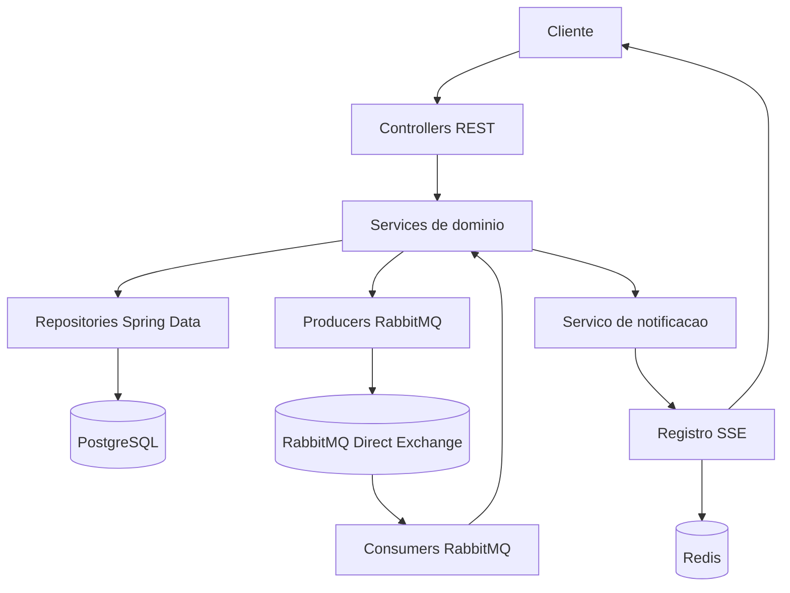
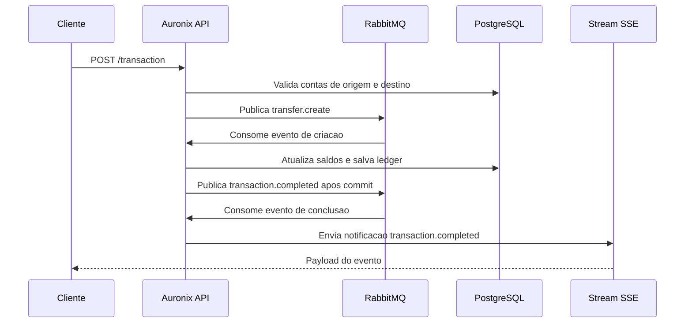
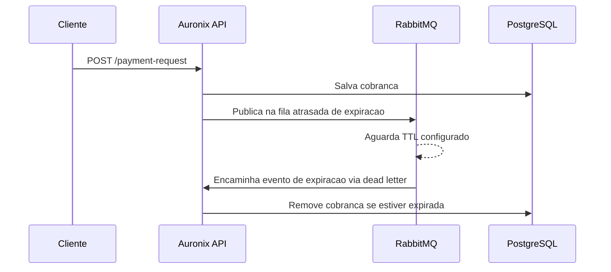

# Arquitetura

## Visao Geral

Auronix e organizado como um backend Spring Boot em camadas. Controllers HTTP recebem requisicoes, services aplicam regras de negocio, repositories Spring Data persistem entidades no PostgreSQL, RabbitMQ transporta eventos assincronos e Redis armazena metadados de conexoes SSE de notificacao.

## Componentes Principais

- Modulo de usuarios: cadastro, login, renovacao de token por `/user`, atualizacao de perfil e remocao.
- Modulo de contas: consulta de conta pelo usuario autenticado e busca de conta por e-mail de usuario.
- Modulo de transacoes: valida solicitacoes de transferencia, publica eventos assincronos, registra ledger e publica eventos de conclusao.
- Modulo de cobrancas: cria cobrancas, consulta cobrancas ativas e remove cobrancas expiradas por fluxo atrasado no RabbitMQ.
- Modulo de notificacoes: expoe stream SSE e envia notificacoes de transacoes concluidas aos usuarios envolvidos.
- Seguranca compartilhada: cria e valida JWTs, gera hashes de senha com Argon2 e autentica requisicoes pelo cookie `access_token`.

## Fluxos Principais

## Relacao com Infraestrutura

O Terraform esta dividido em duas stacks. A stack de cluster provisiona VPC e EKS na AWS. A stack de aplicacao le os manifests YAML de `k8s` e os aplica pelo provider Kubernetes do Terraform.
