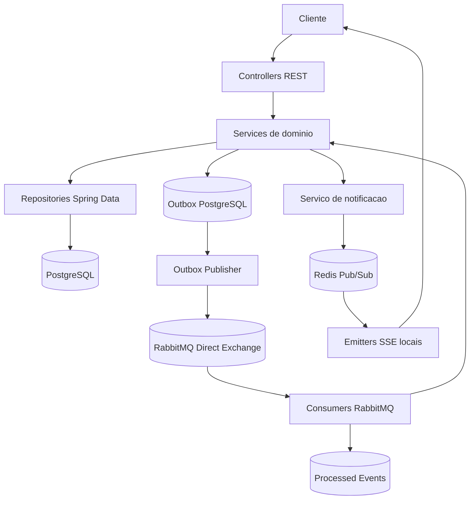
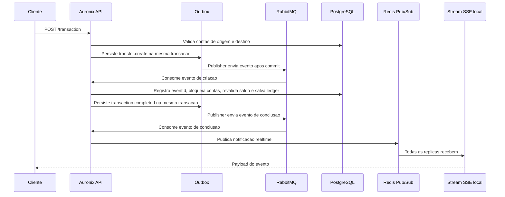
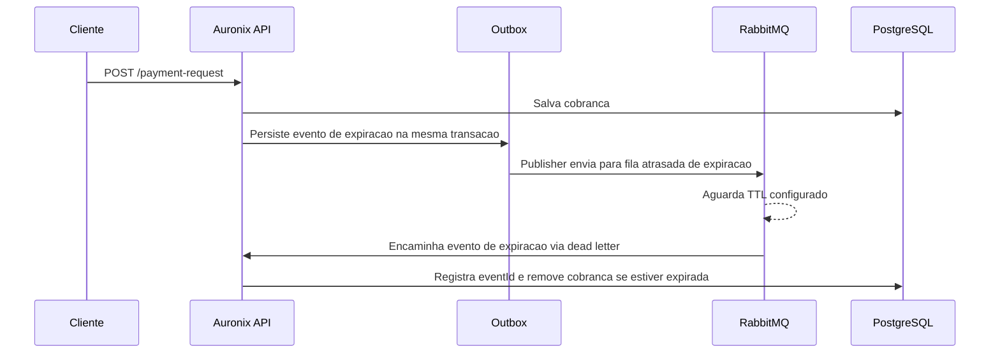

# Arquitetura

## Visao Geral

Auronix e organizado como um backend Spring Boot em camadas. Controllers HTTP recebem requisicoes, services aplicam regras de negocio, repositories Spring Data persistem entidades no PostgreSQL, a outbox transacional registra eventos no mesmo commit do estado de negocio, RabbitMQ transporta eventos assincronos e Redis distribui notificacoes realtime entre replicas.

## Componentes Principais

- Modulo de usuarios: cadastro, login, renovacao de token por `/user`, atualizacao de perfil e remocao.
- Modulo de contas: consulta de conta pelo usuario autenticado e busca de conta por e-mail de usuario.
- Modulo de transacoes: valida solicitacoes de transferencia, registra eventos de criacao na outbox, liquida transferencias de forma idempotente, bloqueia contas em ordem deterministica, registra ledger e gera evento de conclusao.
- Modulo de cobrancas: cria cobrancas, consulta cobrancas ativas, registra evento de expiracao na outbox e remove cobrancas expiradas por fluxo atrasado no RabbitMQ.
- Modulo de notificacoes: expoe stream SSE, publica eventos realtime no Redis Pub/Sub e envia apenas pelas replicas que possuem o emitter local.
- Seguranca compartilhada: cria e valida JWTs, gera hashes de senha com Argon2 e autentica requisicoes pelo cookie `access_token`.
- Mensageria compartilhada: persiste `eventId` processado com constraint unica antes do efeito de negocio para obter idempotencia transacional.
- Outbox compartilhada: persiste eventos com `PENDING`, `PROCESSING` e `PUBLISHED`, usa `FOR UPDATE SKIP LOCKED` para multiplos publishers e faz retry com backoff.

## Fluxos Principais

## Garantias Transacionais

O PostgreSQL e a fonte de verdade para saldos, ledger, idempotencia e outbox. A aplicacao nao faz transacao distribuida entre PostgreSQL e RabbitMQ. O modelo usado e entrega at-least-once com outbox transacional e consumers idempotentes.

Quando uma operacao de negocio precisa emitir evento, o estado de negocio e o registro em `outbox_events` sao persistidos na mesma transacao PostgreSQL. Se o processo morrer depois do commit e antes do RabbitMQ, o evento continua no banco e sera publicado por um publisher posterior.

O publisher reivindica eventos publicaveis com `FOR UPDATE SKIP LOCKED`, marca registros como `PROCESSING`, publica no RabbitMQ e marca como `PUBLISHED`. Se a publicacao falhar, o evento volta para `PENDING` com `attempts` incrementado e `nextAttemptAt` calculado por backoff.

Se o RabbitMQ receber o evento e o processo morrer antes de marcar a outbox como publicada, pode haver republicacao. Isso e aceitavel porque os consumers persistem `eventId` em `processed_events` com constraint unica dentro da mesma transacao do efeito financeiro.

## Concorrencia Financeira

Transferencias bloqueiam as duas contas com `PESSIMISTIC_WRITE` em ordem deterministica pelo UUID da conta. As invariantes criticas sao verificadas na transacao que realmente altera os saldos, mesmo que uma validacao anterior no request HTTP ja tenha passado.

O banco reforca invariantes com constraints para saldo nao negativo, valor de ledger positivo, snapshots de saldo nao negativos, valor de cobranca positivo e expiracao posterior a criacao.

## Realtime Distribuido

Cada replica mantem apenas os `SseEmitter` locais. Quando uma transferencia concluida deve ser notificada, a aplicacao publica uma mensagem realtime no Redis Pub/Sub. Todas as replicas recebem a mensagem e apenas a replica que possui o emitter do usuario envia o SSE.

Redis Pub/Sub nao fornece replay duravel. Se uma conexao SSE cair durante um evento, o cliente deve reconectar e consultar o estado persistido pelos endpoints HTTP.

## Failure Modes

- Banco commitou e o processo morreu antes do RabbitMQ: a outbox permanece no PostgreSQL e outro ciclo do publisher publica posteriormente.
- RabbitMQ entregou a mesma mensagem duas vezes: o `eventId` unico em `processed_events` impede reaplicar o efeito financeiro.
- Dois consumers recebem o mesmo evento simultaneamente: apenas um insert atomico vence a constraint unica de `eventId`.
- Publisher publicou e morreu antes de atualizar a outbox: pode republicar; a idempotencia do consumer preserva a corretude.
- Duas transferencias concorrem sobre as mesmas contas: locks em ordem deterministica reduzem deadlocks previsiveis e a transacao revalida saldo.
- SSE esta conectado em outra replica: Redis Pub/Sub entrega a notificacao a todas as replicas e a dona do emitter envia ao cliente.
- Pod recebe SIGTERM: o servidor usa shutdown graceful e o manifesto Kubernetes usa `preStop` e janela de terminacao para reduzir interrupcoes durante rolling updates.
- Redis indisponivel: notificacoes realtime podem falhar ou atrasar, mas o estado financeiro confirmado permanece no PostgreSQL.
- RabbitMQ indisponivel: eventos ficam na outbox e sao tentados novamente com backoff.

## Relacao com Infraestrutura

O Terraform esta dividido em duas stacks. A stack de cluster provisiona VPC e EKS na AWS. A stack de aplicacao le os manifests YAML de `k8s` e os aplica pelo provider Kubernetes do Terraform.

Os manifests Kubernetes usam replicas multiplas para o servidor, probes separados de liveness/readiness, shutdown graceful, HPA com minimo de duas replicas, imagem Auronix por digest e Postgres em `StatefulSet` com PVC para ambiente local ou de desenvolvimento. Para producao AWS, o caminho recomendado continua sendo PostgreSQL externo ao ciclo de vida dos Pods, como RDS ou Aurora, configurado por variaveis e Secrets.
