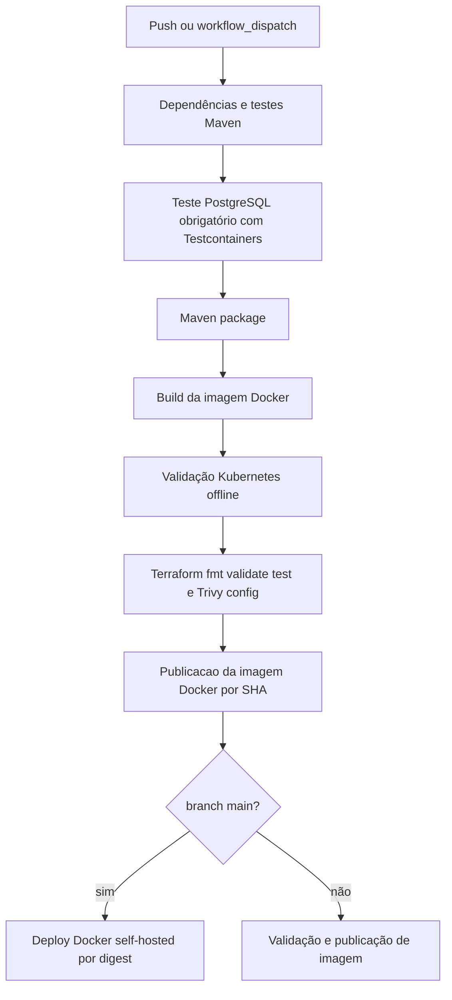

# CI/CD

## Workflow

O repositório contém `.github/workflows/main.yml`, chamado `Continuous Integration and Deployment`.

## Gatilhos, Permissões e Concorrência

O workflow roda em todo push para qualquer branch e também por `workflow_dispatch`. As permissões são `contents: read` e `packages: write`. A concorrência é agrupada por workflow e referência Git, cancelando execuções em andamento para a mesma ref.

## Job Validate

`validate` roda em `ubuntu-latest` e executa, em ordem:

1. Checkout.
2. Setup Java Temurin 26 com cache Maven.
3. Setup de `kubectl`.
4. Setup de Terraform.
5. Permissao de execução para o Maven Wrapper.
6. `./mvnw -B dependency:go-offline`.
7. `./mvnw -B test`.
8. Execução obrigatória de `FinancePostgresIntegrationTest` com Docker/Testcontainers, seguida por asserts no XML para garantir `skipped`, `failures` e `errors` iguais a zero.
9. `./mvnw -B package -DskipTests`.
10. `docker build -t auronix-server:${{ github.sha }} .`.
11. `./scripts/validate-k8s-offline.ps1`.
12. `./scripts/validate-terraform.ps1`.

Esse job valida aplicação, comportamento PostgreSQL específico, build Docker, manifests Kubernetes renderizados por Kustomize, Terraform e scan estático de infraestrutura. Ele não executa Terraform apply e não faz deploy em EKS.

## Job Publish

`publish` depende de `validate`. Ele faz checkout, configura Docker Buildx, autentica no Docker Hub com `DOCKER_USERNAME` e `DOCKER_PASSWORD`, gera metadata Docker para `docker.io/jpplay/auronix-server` e publica uma tag SHA longa. O digest da imagem publicada é exposto como `image_digest`.

A configuração atual de metadata não publica `latest`.

## Job Deploy

`deploy` roda apenas em `refs/heads/main`, depois de `publish`, em runner self-hosted. Ele grava o secret `DOTENV` em `.env`, autentica no Docker Hub, baixa a imagem publicada por digest, remove qualquer container `auronix-server` existente e inicia um novo container na rede Docker `cloudflare_tunnel` com limites de recurso e `--restart=always`.

Esse é um deploy Docker em runner self-hosted. O workflow não executa deploy produtivo em EKS.

## Formato do Pipeline

## Separacao de Responsabilidades

- Validação CI: `validate`.
- Publicacao de container: `publish`.
- Validação de infraestrutura: Kubernetes offline e Terraform dentro de `validate`.
- Deploy produtivo neste workflow: substituição de container Docker self-hosted no `main`, não EKS.
