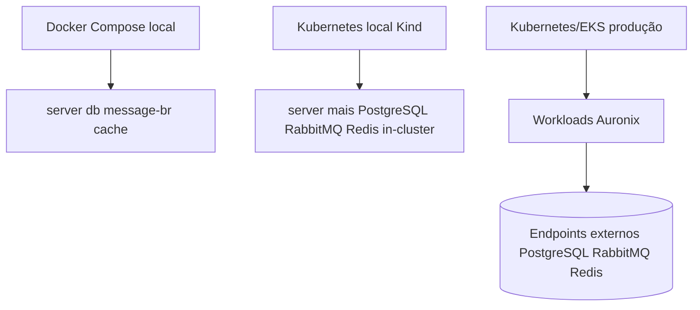

# Infraestrutura

## Docker Compose Local

`compose.yaml` é a topologia local de desenvolvimento. Ele não representa a arquitetura de produção.

| Servico | Imagem/origem | Portas | Persistencia | Health check |
| --- | --- | --- | --- | --- |
| `server` | build local do `Dockerfile` | `8080:8080` | nenhuma | TCP na porta `8080` |
| `db` | `postgres:17-alpine` | `5432:5432` | `auronix-data` | `pg_isready -U postgres -d auronix` |
| `message-br` | `rabbitmq:4-management` | `5672:5672`, `15672:15672` | `auronix-rabbitmq` | `rabbitmq-diagnostics ping` e checagem da porta AMQP |
| `cache` | `redis:8-alpine` | `6379:6379` | `auronix-redis` | `redis-cli ping` |

O server depende de `db`, `message-br` e `cache` saudáveis. As dependências usam `restart: always`; o server usa `restart: unless-stopped`. Redis inicia com persistência AOF por `redis-server --appendonly yes`. Todos os serviços compartilham a rede interna `auronix-local`.

URLs usadas pelo backend dentro da rede Compose:

- PostgreSQL: `jdbc:postgresql://db:5432/auronix`
- RabbitMQ: `amqp://message-br:5672/`
- Redis: `redis://cache:6379`

## Imagem de Container

O `Dockerfile` usa build multi-stage:

1. Etapa de dependências `eclipse-temurin:26-jdk-jammy` com cache Maven.
2. Etapa de package com `./mvnw package -DskipTests`.
3. Extracao via Spring Boot layertools.
4. Runtime `eclipse-temurin:26-jre-jammy`.

A imagem final roda como usuário não-root `appuser`, expõe `8080` e inicia `org.springframework.boot.loader.launch.JarLauncher`.

## Topologias Kubernetes

Os manifests Kubernetes existem em duas formas:

- Base e overlays Kustomize em `k8s/base` e `k8s/overlays`.
- Manifests planos em `k8s/*.yaml`, consumidos por `infra/terraform/app`.

A validação local Kustomize inclui PostgreSQL, RabbitMQ e Redis no cluster. A produção Kustomize remove esses workloads de dependências e espera endpoints externos.

## AWS e Terraform

`infra/terraform/cluster` provisiona VPC e EKS na AWS. `infra/terraform/app` aplica recursos Kubernetes a partir do conjunto plano `k8s/*.yaml`. O Terraform atual não declara RDS/Aurora, Amazon MQ, ElastiCache ou equivalentes gerenciados de PostgreSQL/RabbitMQ/Redis.

## Limites Atuais

- Docker Compose é apenas local.
- Manifests Kubernetes de produção exigem endpoints externos de banco, broker e Redis.
- Terraform não provisiona PostgreSQL, RabbitMQ ou Redis gerenciados.
- Redis Pub/Sub é fan-out realtime, não armazenamento durável de notificações.
- Kind valida comportamento de workloads em cluster local descartável, mas não substitui validação em EKS.
