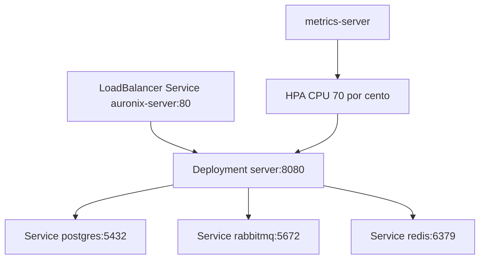

# Kubernetes

## Conjunto de Recursos

A pasta `k8s` contem manifests para o namespace `auronix` e servicos de runtime:

- `namespace.yaml`: cria o namespace `auronix`.
- `configmap.yaml`: configuracoes de runtime, como `PORT`, URL do banco, URL do RabbitMQ, URL do Redis e opcoes JPA.
- `secrets.yaml`: chaves esperadas para credenciais de banco, credenciais RabbitMQ e assinatura JWT.
- `server.yaml`: deployment da API e service `LoadBalancer`.
- `postgres.yaml`: deployment PostgreSQL e service interno.
- `rabbitmq.yaml`: deployment RabbitMQ e service interno.
- `redis.yaml`: deployment Redis e service interno.
- `metrics-server.yaml`: deployment metrics-server e recursos RBAC em `kube-system`.
- `hpa.yaml`: HorizontalPodAutoscaler para o deployment da API.

## Topologia de Runtime

## Deployment da API

O deployment `server` usa a imagem `jpplay/auditex-server:latest`, `imagePullPolicy: Always` e porta de container `8080`. Ele recebe configuracoes de `auronix-config` e valores sensiveis de `auronix-secrets`. Readiness e liveness probes apontam para `/actuator/health`.

As requests de recursos sao `250m` de CPU e `512Mi` de memoria. Os limits sao `750m` de CPU e `1Gi` de memoria. O service `auronix-server` e do tipo `LoadBalancer`, mapeando a porta `80` para a porta `http` do container.

## Dependencias

PostgreSQL, RabbitMQ e Redis rodam como deployments de uma replica com services internos ClusterIP. PostgreSQL e RabbitMQ usam readiness e liveness probes baseados em comandos diagnosticos nativos. Redis usa `redis-cli ping`.

Observacao importante: o manifest do Postgres armazena dados em `emptyDir`. Para ambientes produtivos, recomenda-se volume persistente e estrategia de backup/migration.

## Autoscaling e Metricas

O HPA aponta para o deployment `server`, com uma a tres replicas e alvo de 70 por cento de utilizacao de CPU. O manifest metrics-server incluido fornece a API de metricas exigida pelo HPA.
