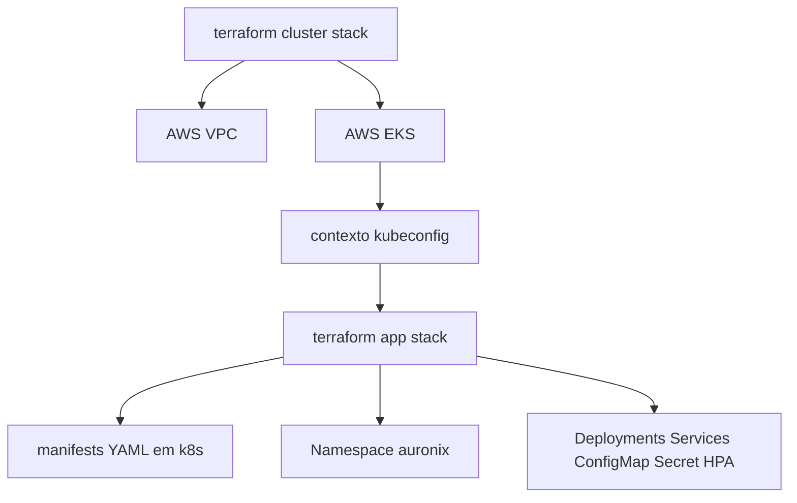

# Terraform

## Organizacao

O Terraform esta dividido em duas stacks:

- `infra/terraform/cluster`: provisiona rede AWS e EKS.
- `infra/terraform/app`: aplica manifests Kubernetes em um contexto Kubernetes existente.

## Stack de Cluster

A stack de cluster requer Terraform `>= 1.6.0` e provider AWS `~> 5.0`. Ela usa:

- `terraform-aws-modules/vpc/aws` `~> 5.0`
- `terraform-aws-modules/eks/aws` `~> 20.0`

As principais variaveis incluem regiao AWS, ambiente, nome do cluster, versao Kubernetes, CIDR de services, CIDR da VPC, quantidade de zonas de disponibilidade, modo de NAT Gateway, tipos de instancia e tamanhos do node group.

Os outputs incluem nome do cluster, regiao, endpoint e comando para atualizar o kubeconfig do cluster EKS criado.

## Stack de Aplicacao

A stack de aplicacao requer Terraform `>= 1.6.0` e provider Kubernetes `~> 2.33`. Ela le os arquivos YAML de `k8s`, separa manifests multi-documento, decodifica YAML, converte `Secret.stringData` para `data` em base64, aplica primeiro o namespace e depois aplica os demais recursos.



## Comandos Comuns

```bash
cd infra/terraform/cluster
terraform init
terraform plan
terraform apply
```

```bash
cd infra/terraform/app
terraform init
terraform plan
terraform apply
```

Consideracao operacional: revise `terraform plan` antes de executar `terraform apply`. Comandos destrutivos como `terraform destroy` devem ser usados apenas quando a remocao do ambiente for intencional.
