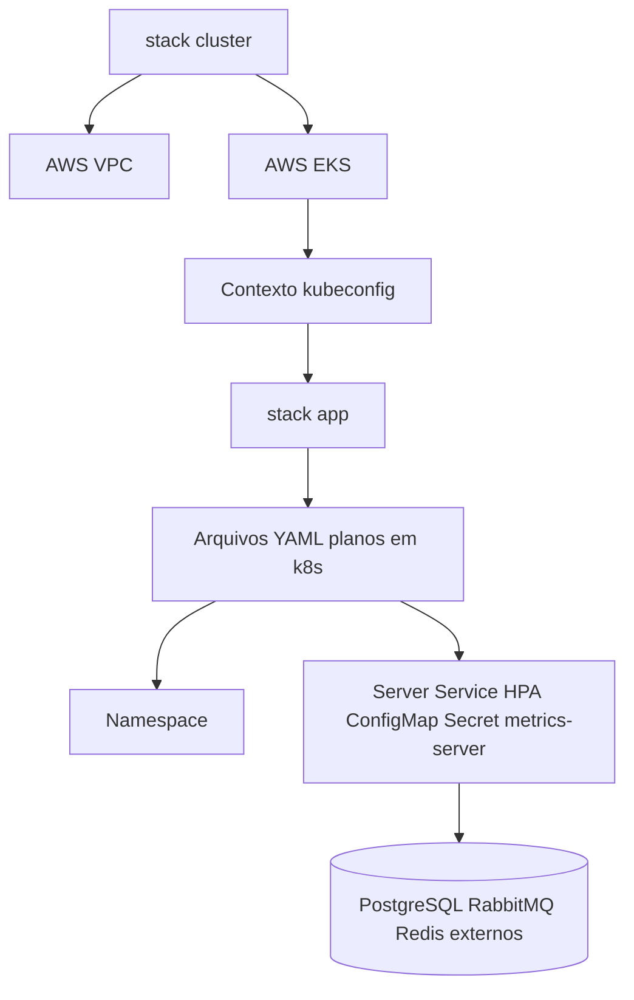

# Terraform

## Organizacao

Terraform é dividido em duas stacks independentes:

- `infra/terraform/cluster`: rede AWS e EKS.
- `infra/terraform/app`: recursos Kubernetes aplicados a um contexto Kubernetes existente.

## Stack Cluster

A stack de cluster exige Terraform `>= 1.6.0` e AWS provider `~> 5.0`. Ela usa `terraform-aws-modules/vpc/aws` `~> 5.0` e `terraform-aws-modules/eks/aws` `~> 20.0`.

Ela declara:

- AWS provider com default tags.
- Data source de availability zones.
- VPC com subnets públicas e privadas derivadas de `vpc_cidr` e `az_count`.
- DNS support e hostnames habilitados.
- NAT Gateway habilitado, com `single_nat_gateway` configurável.
- Tags de load balancer Kubernetes nas subnets.
- Cluster EKS com versão, service CIDR, acesso ao endpoint e add-ons centrais `coredns`, `kube-proxy` e `vpc-cni` configuráveis.
- Managed node group com instance types e tamanhos mínimo/desejado/máximo configuráveis.
- Regras de security group dos nodes, incluindo CIDRs restritos para egress HTTPS.

Outputs expõem nome do cluster, região, endpoint, id da VPC, ids das subnets privadas, id do security group dos nodes e o comando `aws eks update-kubeconfig`.

A stack de cluster não declara RDS/Aurora, Amazon MQ, ElastiCache ou equivalente gerenciado de PostgreSQL/RabbitMQ/Redis.

## Stack App

A stack app exige Terraform `>= 1.6.0` e Kubernetes provider `~> 2.33`. Ela não renderiza os overlays Kustomize. Ela lê esta lista plana de manifests em `k8s/*.yaml`:

- `namespace.yaml`
- `secrets.yaml`
- `configmap.yaml`
- `metrics-server.yaml`
- `server.yaml`
- `hpa.yaml`

Ela divide YAML multi-documento, decodifica cada manifest, converte `Secret.stringData` em `data` base64, aplica o namespace primeiro e depois aplica os demais recursos com `kubernetes_manifest`.

Como esse conjunto plano exclui `postgres.yaml`, `rabbitmq.yaml` e `redis.yaml`, a stack app espera endpoints externos de PostgreSQL, RabbitMQ e Redis a partir de `k8s/configmap.yaml`.



## Testes Terraform

Os testes usam `mock_provider` e overrides para checar contratos sem criar recursos AWS ou Kubernetes.

Testes de cluster verificam, entre outros pontos:

- Validações de environment, CIDR e contagem de nodes rejeitam entradas inválidas.
- Nome da VPC de produção, CIDR, contagem de AZ/subnets, DNS, estratégia de NAT e tags de load balancer são preservados.
- Nome/versão do EKS de produção, endpoint privado por default, permissões do criador, add-ons centrais e CIDRs de egress HTTPS são preservados.
- Desired size do managed node group fica entre min e max e usa instance types configurados.
- Outputs essenciais expõem cluster, endpoint, VPC, subnets privadas e security group dos nodes.

Testes da app verificam:

- A stack app de produção não cria workloads locais de PostgreSQL, RabbitMQ ou Redis.
- Placeholders de endpoints externos de PostgreSQL, RabbitMQ e Redis são obrigatórios no ConfigMap.
- Réplicas do server permanecem 2.
- Limites do HPA permanecem de 2 a 3.
- `terminationGracePeriodSeconds` permanece 45.
- Caminhos de startup, liveness e readiness permanecem `/actuator/health/liveness`, `/actuator/health/liveness` e `/actuator/health/readiness`.

## Comandos de Validação

`scripts/validate-terraform.ps1` executa as duas stacks por:

```text
terraform fmt -check -recursive
terraform init -backend=false
terraform validate
terraform test
Trivy config scan
```

Se existir um binário local `trivy`, ele é usado; caso contrário, o script executa `aquasec/trivy:latest` em Docker. Essa validação não cria infraestrutura AWS.

`terraform validate` verifica validade da configuração. `terraform test` executa asserts definidos no repositório, aqui com providers mockados. `terraform plan` calcula uma mudança proposta contra provider/backend real ou configurado e aparece apenas no script AWS conectado.

## Validação AWS Conectada

`scripts/validate-aws.ps1` exige credenciais AWS válidas. Ele inicia com `aws sts get-caller-identity`; se falhar, imprime que a validação foi ignorada porque as credenciais estão indisponíveis ou expiradas e sai com código 2.

Com credenciais, ele imprime account, ARN, região e cluster, executa Terraform `init`, mostra o workspace, cria um arquivo de plan, descreve o cluster EKS, atualiza kubeconfig, checa acesso kubectl, executa dry-run server-side do overlay de produção e roda `kubectl diff`.

## Apply

`terraform apply` e `terraform destroy` não são executados pelos scripts de validação. Use-os apenas manualmente após revisar account, região, workspace, backend, plan e impacto esperado.
